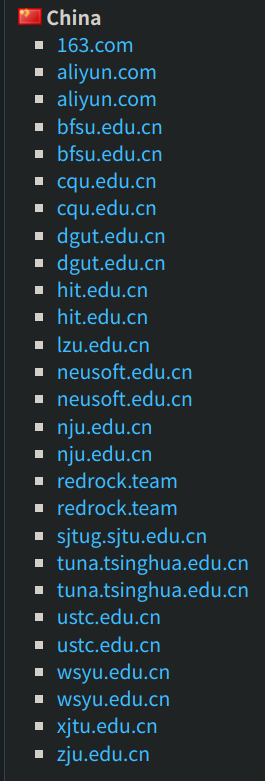
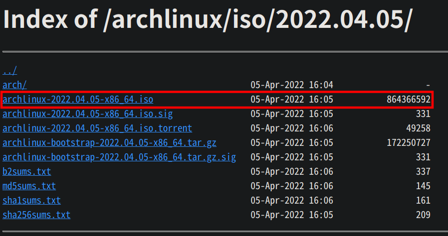
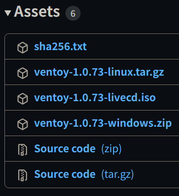
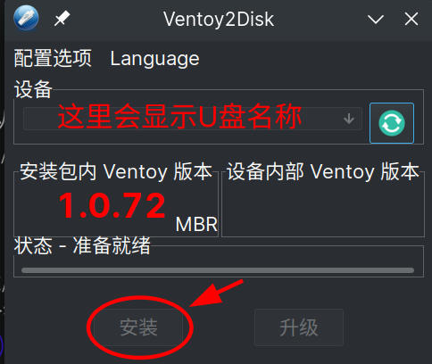
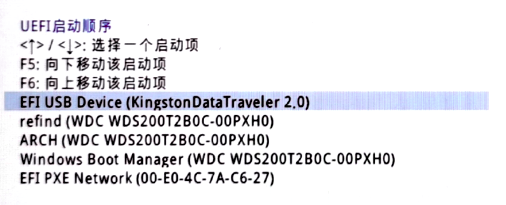
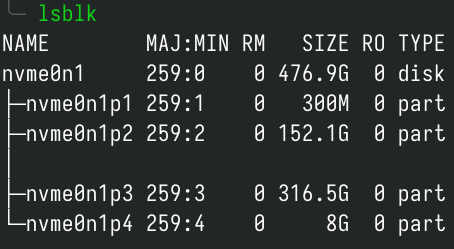
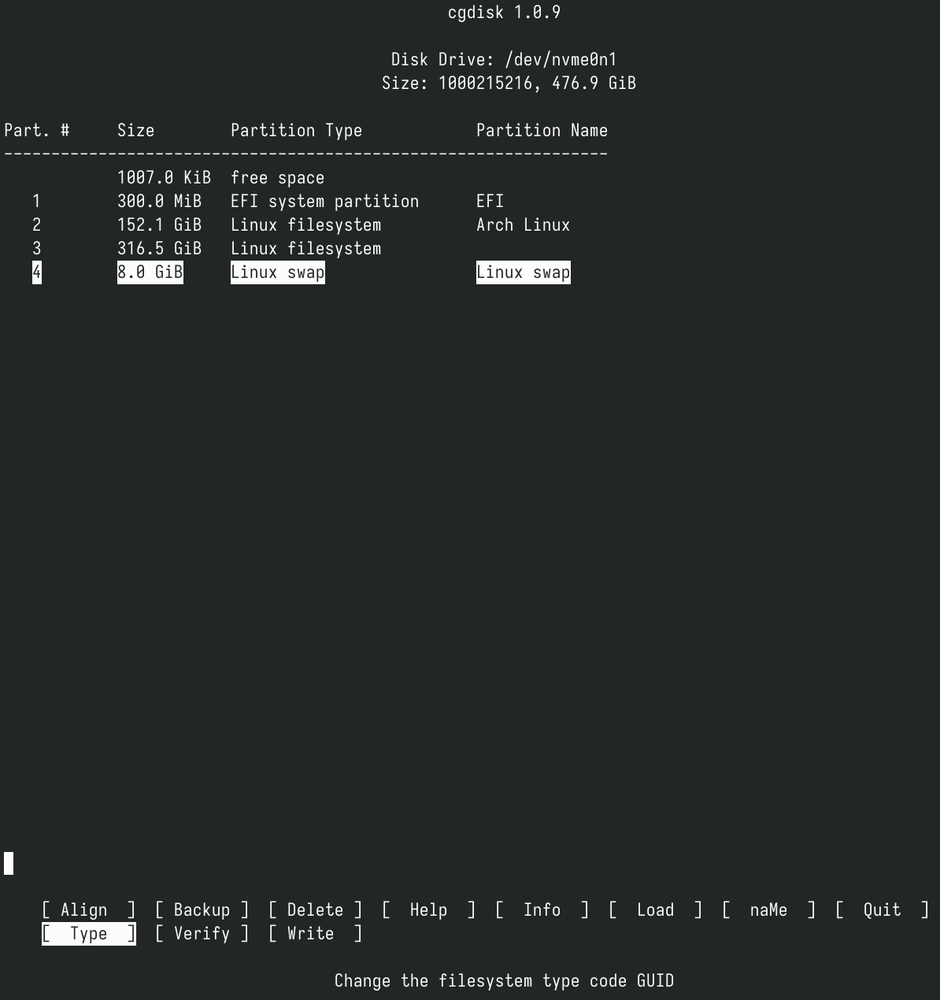
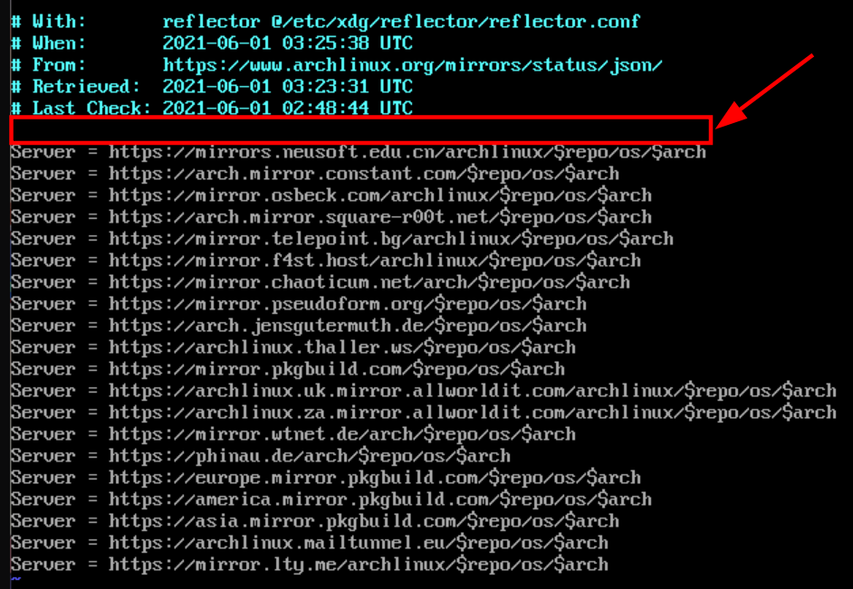
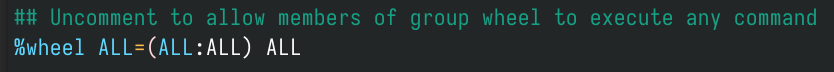
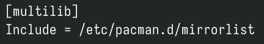

<!--
SPDX-FileCopyrightText: 2024 Integral <integral@member.fsf.org>

SPDX-License-Identifier: GFDL-1.3-or-later
-->

一起来安装 Arch Linux 吧～
（本文以安装 Arch Linux **单系统** 为例，暂不讨论双系统安装）
# 你需要准备

1. 一个 U 盘（容量不少于 1GB，最好是 USB 3.0）
2. 一台 x86-64 架构的电脑（从 2017 年开始 Arch Linux 不支持 i386 架构）
3. 一个较好的网络环境，无线/有线网络均可，**不能是需要认证的网络（如大学校园网）**

# 开始安装吧！

## 先下载 Arch Linux 镜像和 Ventoy 启动器

首先从 https://archlinux.org/download/ 下载最新版 Arch Linux 镜像
往下翻找到 China，选择一个镜像源（个人喜欢中科大 ustc.edu.cn）：

找到 iso 镜像点击下载。


下载完镜像后，前往 https://github.com/ventoy/Ventoy/releases 下载 Ventoy 启动器（根据自己的系统类型选择）：

插入U盘后打开Ventoy。

#### **如果是初次制作 ventoy，制作前请注意备份好U盘数据！！**

待U盘名称正常显示后点击安装：

Ventoy 安装完成后，将 Arch Linux 的镜像文件复制到U盘中，弹出U盘。

**注意提前备份硬盘重要数据！！**

## 重启电脑，正式开始安装

插入 U 盘并开机。在开机的时候，按下 F2/F12/Enter/Delete 等（取决与你的主板型号，具体请查阅你主板的相关信息）按键，进入主板的 BIOS 设置界面。
在名为 Security（安全） 的选项卡中，找到 Secure Boot（安全启动）的选项，选择 Disable/关闭 将其禁用。
在名为 Boot（启动） 的选项卡中，找到名为 Boot Options（启动顺序，名称可能略有差异）的设置选项，将 U盘（USB Device）的启动顺序调整到首位。

在名为 Exit（退出） 的选项卡中，保存 BIOS 设置并退出（Save Configurations And Exit）。
进入 Ventoy 选择菜单，选择 Arch Linux ISO，回车，等待加载完毕即进入安装界面。

## 连接网络

### 1.有线网络

插上网线，等待片刻即可。

### 2.无线网络

输入 ```iwctl``` 回车进入无线网络工具，依次执行如下命令。

```bash
device list #列出无线网卡（一般来说是 wlan0）
station wlan0 scan #扫描无线网络
station wlan0 get-networks #列出所有可用的无线网络
station wlan0 connect SSID #SSID 即为 Wi-Fi 名称，可输入一部分然后按 Tab 键补全
```

输入密码后回车，然后执行 ```exit```。
注意：**要连接名称里带空格的网络，连接时要用双引号将网络名称括起来。**

### 测试网络是否正常连接

执行

```bash
ping archlinux.org -c 5
```

即可测试与 Arch Linux 服务器是否正常连接。（-c 后面的数字表示连接的次数）

## 与互联网同步日期时间

执行

```bash
timedatectl set-ntp true
```

即可同步。
可以使用 ```timedatectl status``` 检查服务状态。

## 建立与格式化硬盘分区（使用 Btrfs 文件系统）

执行 ```lsblk``` 查看硬盘详情。

图中所示是我的硬盘，最左边 nvme0n1 是硬盘设备名，下面的 nvme0n1p1、nvme0n1p2...是分区设备名。

### 注意：硬盘命名规则

| 硬盘类型                 | 设备文件名                |
| -------------------- | -------------------- |
| SATA 硬盘/U 盘等 SCSI 设备 | /dev/sd[a-z]         |
| NVMe 硬盘              | /dev/nvme[0-9]n[1-9] |
| 虚拟硬盘                 | /dev/vd[a-z]         |

对于 SATA 硬盘/U 盘/虚拟硬盘来说，系统采用 a~z 来代表26块不同的硬盘（默认从a开始分配）。对于 NVMe 硬盘来说，第一个数字表示控制器序号（从0开始），第二个数字表示命名空间（namespace）序号（从1开始）。但是对于消费级 NVMe 硬盘而言，一块硬盘一般只有一个命名空间，因此我们一般见到的是 ```/dev/nvme[0-9]n1```。
找到需要安装 Arch Linux 的硬盘后，执行

```bash
cgdisk 设备文件名
```

即可进入分区管理界面（下图是已经分好区的硬盘）

在分区管理界面，可以使用上、下、左、右键移动位置。

对于 Arch Linux，以下分区是必须要有的：
一个根分区（挂载在根目录）/；
要在 UEFI 模式中启动，还需要一个 EFI 系统分区（100MB 就完全足够了）。

**如果硬盘上原来有操作系统，安装 Arch Linux 单系统需要先删除原来的分区。删除方法：先用上下键选中要删除的分区，然后用左右键选择 Delete，回车。**

### 1.创建根分区

先用上下键选中一块空闲空间（free space），然后用左右键选择New，回车。

First sector，保持默认即可，回车。

Size in sectors or {KMGTP}，输入根分区的大小（建议大于 64G），以**数字+G**（如80G）的形式输入，回车。

Hex code or GUID，输入 `8304` (对应 **Linux x86-64 root**)，回车。

Enter new partition name，输入分区名，回车。

### 2.创建交换分区

与创建根分区方法类似，**在分区大小和 Hex code or GUID 上有所不同，Hex code or GUID 应为8200**。交换分区大小建议：
| 物理内存    | 交换分区大小 | 开启休眠的交换分区大小 |
| ----------- | ------------ | ---------------------- |
| ⩽ 2GB       | 内存的 2 倍    | 内存的 3 倍              |
| 2GB ～ 8GB  | 等于内存大小 | 内存的 2 倍              |
| 8GB ～ 64GB | 至少 4GB     | 内存的 1.5 倍            |
| > 64GB      | 至少 4GB     | 不建议使用休眠         |

（摘自 Red Hat Recommended System Swap Space ）

### 3.如果你还想创建其他分区（可选）

比如你想为 Arch Linux 再建一个数据盘。方法和创建根分区相同。

创建完分区后（**请确认分区正确！！**），选择 Write 并回车，输入 yes 回车，写入分区表。
然后选择 Quit 回车，退出 cgdisk。

### 4.格式化硬盘分区

分区完成后，可执行 ```lsblk``` 查看分区状态。

找到 EFI 分区（一般在最前面，大小 100M ~ 300M）
执行下面命令格式化 EFI 分区：

```bash
mkfs.fat -F 32 /dev/EFI分区设备名 #图中EFI分区设备名为nvme0n1p1，请根据自己lsblk的实际情况替换
```

找到根分区，执行下面命令格式化根分区：

```bash
mkfs.btrfs -f /dev/根分区设备名 #图中根分区设备名为nvme0n1p2，请根据自己lsblk的实际情况替换
```

找到交换分区，执行下面命令格式化交换分区：

```bash
mkswap /dev/交换分区设备名 #图中交换分区设备名为nvme0n1p4，请根据自己lsblk的实际情况替换
```

### 5.挂载分区

**挂载分区的顺序不要颠倒，否则可能遇到安装完成后无法启动系统的问题。**

先执行下面命令挂载根分区：

```bash
mount /dev/根分区设备名 /mnt
```

由于我们用的是 Btrfs 文件系统，所以接下来需要创建子卷。
执行下面命令创建根目录子卷：

```bash
btrfs subvolume create /mnt/@
```

如有需要，可执行下面命令创建 /home 子卷（可选）：
**（创建 /home 子卷后，根目录和用户的家目录将会分开放置）**

```bash
btrfs subvolume create /mnt/@home
```

创建完子卷后，执行下面命令卸载根分区：

```bash
umount /dev/根分区设备名
```

请在下面两种根分区的 /@ 子卷挂载方式中 **选择一种** 挂载：
1. 挂载时启用透明压缩功能（能减少空间占用，但大量读写时会小幅增加 CPU 占用，如果 CPU 性能还不错可以开启）

```bash
mount /dev/根分区设备名 /mnt -o compress=zstd:1,subvol=@
```

2. 挂载时不启用透明压缩功能

```bash
mount /dev/根分区设备名 /mnt -o subvol=@
```

- 此处选用高效的 zstd 压缩算法进行透明压缩，并使用相对最适合 NVMe SSD 的压缩等级（1）。

#### 压缩等级选择建议（仅供参考）

| 磁盘类型 | CPU 性能 | 压缩建议 |
| -------- | -------- | -------- |
| NVMe SSD, PCIe 4.0 x4 / 5.0 x4 | / | 不压缩 |
| NVMe SSD, PCIe 3.0 x4 | 很强（zstd:1 压缩速度不低于 3 GiB/s，建议 4 GiB/s）| zstd:1 |
| NVMe SSD, PCIe 3.0 x4 | zstd:1 压缩速度低于 3 GiB/s | 不压缩 |
| SATA SSD | 较好 | zstd:3（zstd 默认压缩等级）|
| SATA SSD | 较差 | zstd:2 |
| HDD | / | 根据需求在 zstd:4 ~ zstd:8 之间选择。CPU 性能越高，建议选择的压缩等级也越高 |

执行下面命令挂载 EFI 分区：

```bash
mount --mkdir /dev/EFI分区设备名 /mnt/efi
```

- ```/boot/efi``` 已被弃用，建议使用 ```/efi``` 代替 ```/boot/efi```。
- ```/efi``` is a replacement for the historical and now **discouraged** ESP mountpoint ```/boot/efi```. (https://wiki.archlinux.org/title/EFI_system_partition#Typical_mount_points)

执行下面命令挂载交换分区：

```bash
swapon /dev/交换分区设备名
```

如果你创建了 @home 子卷，请在下面两种挂载方式中 **选择一种** 挂载：

1. 启用透明压缩功能

```bash
mount --mkdir /dev/根分区设备名 /mnt/home -o compress=zstd:1,subvol=@home
```

2. 不启用透明压缩功能

```bash
mount --mkdir /dev/根分区设备名 /mnt/home -o subvol=@home
```

挂载完成后，可使用```lsblk```命令查看挂载情况。

## 修改镜像源
先执行以下命令关闭 reflector：

```bash
systemctl stop reflector 
```

然后执行

```bash
vim /etc/pacman.d/mirrorlist
```

打开镜像源文件。
将光标移到第一行镜像源的上一行，按下键盘上的 O

添加国内镜像源（此处以中科大镜像源为例）：

```
Server = https://mirrors.ustc.edu.cn/archlinux/$repo/os/$arch
```

然后按 Esc 键，输入 :wq，回车，保存并退出。

## 安装系统

对于 **AMD CPU**，执行如下命令开始安装系统：

```bash
pacstrap /mnt base base-devel linux linux-firmware linux-headers vim bash-completion btrfs-progs amd-ucode
```

对于 **Intel CPU**，执行如下命令开始安装系统：

```bash
pacstrap /mnt base base-devel linux linux-firmware linux-headers vim bash-completion btrfs-progs intel-ucode
```

#### 备注

- base-devel：基础开发工具包（包括 gcc g++ make 等等）
- vim：常用的文本编辑器
- bash-completion：提供 bash 终端 Tab 键补全命令的功能
- btrfs-progs：Btrfs 文件系统管理工具
- amd-ucode/intel-ucode：CPU 微码

## 生成 fstab 文件

用以下命令生成 fstab 文件：

```bash
genfstab -U /mnt >> /mnt/etc/fstab
```

然后执行下面命令编辑 fstab 文件：
```bash
vim /mnt/etc/fstab
```

按键盘上的 i 进入插入模式。

找到文件系统为 btrfs 的一行或两行，添加 ```nodiscard``` 参数，**注意前后的逗号**。

按 Esc 键，输入 :wq，回车，保存退出。

- 下面是根分区 /@ 子卷的挂载参数示例。

```
rw,relatime,nodiscard,compress=zstd:1,ssd,space_cache=v2,subvol=/@
```

- 下面是根分区 /@home 子卷的挂载参数示例。

```
rw,relatime,nodiscard,compress=zstd:1,ssd,space_cache=v2,subvol=/@home
```

## Chroot 进入新系统

执行以下命令变更根目录，进入新系统：

```bash
arch-chroot /mnt
```

## 设置时区

执行下面命令设置 Asia/Shanghai 时区：

```bash
ln -sf /usr/share/zoneinfo/Asia/Shanghai /etc/localtime
```

如果需要设置其他时区：

```bash
ln -sf /usr/share/zoneinfo/Region（地区名）/City（城市名） /etc/localtime
```

执行下面命令与硬件时间同步：

```bash
hwclock --systohc
```

## 本地化

执行下面命令打开 locale.gen 文件：

```bash
vim /etc/locale.gen
```

按键盘上的 i 进入插入模式。
往下翻找到 ```en_US.UTF-8 UTF-8```，将前面的注释符（#）删去。
然后按 Esc 键，输入 :wq，回车，保存退出。
**注意：在安装阶段不要设置中文 locale，可能导致 tty 乱码。**
然后执行

```bash
locale-gen
```

生成 locale 信息。

执行下面命令新建 locale.conf 文件：

```bash
vim /etc/locale.conf
```

按键盘上的 i 进入插入模式，然后输入 

```
LANG=en_US.UTF-8
```

按 Esc 键，输入 :wq，回车，保存退出。

## 网络设置

执行下面命令新建 hostname 文件：

```bash
vim /etc/hostname
```

按键盘上的 i 进入插入模式，然后输入自己喜欢的主机名，输入完后按 Esc 键，输入 :wq，回车，保存退出。

## Root 用户密码设置

执行下面命令设置 Root 用户密码：

```bash
passwd
```

（输入密码时不会有任何显示）

## 普通用户的创建与设置

执行下面命令创建一个普通用户：

```bash
useradd -m -G wheel,storage 用户名
```

执行下面命令为这个用户设置密码：

```bash
passwd 用户名
```

编辑超级用户文件：

```bash
EDITOR=vim visudo
```

按键盘上的 i 进入插入模式。
往下翻找到 "Uncomment to allow members of group wheel to execute any command"
将下面一行 %wheel 前的注释符（#）删去。

按 Esc 键，输入 :wq，回车，保存退出。

## 安装 GRUB 引导程序

执行 ```lsblk``` 确保 ```/efi``` 分区已正确挂载。
然后执行下面命令安装 grub 和 efibootmgr：

```bash
pacman -S grub efibootmgr
```

将 GRUB 安装到 EFI 分区：

```bash
grub-install --efi-directory=/efi --bootloader-id=GRUB
```

使用以下命令生成 GRUB 配置文件：

```bash
grub-mkconfig -o /boot/grub/grub.cfg
```

- GRUB 的很多选项都是可定制的。关于如何修改 GRUB 的启动顺序、主题、内核启动参数等问题，请参阅 https://wiki.archlinuxcn.org/title/GRUB 。
## SSD TRIM

执行下面命令开启 SSD 的 TRIM 功能：

```bash
systemctl enable fstrim.timer
```

## 可选：启用 32 位应用支持（若不需要安装 Wine/Steam 则无需开启）

执行下面命令打开 pacman.conf：

```bash
vim /etc/pacman.conf
```

按键盘上的 i 进入插入模式。
往下翻找到```[multilib]```，将```[multilib]```**这一行和下一行**前面的注释符（#）删去。

按 Esc 键，输入 :wq，回车，保存退出。

## 网络、蓝牙与声音

执行下面命令安装网络相关工具：

```bash
pacman -S networkmanager
```

执行下面命令启用网络服务：

```bash
systemctl enable NetworkManager
```

执行下面命令安装蓝牙、声卡驱动和其他工具：

```bash
pacman -S bluez cups xdg-utils xdg-user-dirs pipewire-pulse pipewire-jack openssh
```

- 此处使用了新一代声音服务器 PipeWire，延迟比 PulseAudio 更低。有关 PipeWire 的其他信息，请参阅 https://wiki.archlinux.org/title/PipeWire 。

如果电脑有蓝牙功能，执行下面命令启用蓝牙：

```bash
systemctl enable bluetooth
```

执行下面命令启用打印机服务：

```bash
systemctl enable cups
```

如果需要做测试，可执行下面命令启用 SSH 服务：

```bash
systemctl enable ssh
```

## 显卡驱动

### Intel 核显

执行下面命令安装 Intel 核显驱动：

```bash
pacman -S mesa vulkan-intel
```

注意，只有 Ivy Bridge 及更新架构的 CPU 核显才支持 vulkan。

#### Intel QuickSync Video 驱动

Broadwell 及更新架构：

```bash
pacman -S intel-media-driver
```

Haswell 及更早架构：

```bash
pacman -S libva-intel-driver
```

### NVIDIA 独显

执行下面命令安装 N 卡驱动：

```bash
pacman -S nvidia-dkms opencl-nvidia nvidia-settings
```

需要 CUDA 可使用以下命令安装：

```bash
pacman -S cuda
```

执行下面命令编辑 GRUB 参数：

```bash
vim /etc/default/grub
```

按键盘上的 i 键进入插入模式。

在 ```GRUB_CMDLINE_LINUX_DEFAULT``` 中添加如下内容：

```bash
nvidia-drm.modeset=1
```

按 Esc 键，输入 :wq，回车，保存退出。

执行下面命令重新生成 grub.cfg：

```bash
grub-mkconfig -o /boot/grub/grub.cfg
```

### AMD 核显/AMD 独显

执行下面命令安装 AMD 显卡驱动：

```bash
pacman -S mesa vulkan-radeon
```

按 Esc 键，输入 :wq，回车，保存退出。

## 安装完成，重启进入 Arch Linux

执行下面命令退出 Chroot：

```bash
exit
```

取消挂载 /mnt 下的所有分区：

```bash
umount -R /mnt
```

关机：

```bash
poweroff
```

拔掉安装 U 盘，开机。

## 登录系统，连接网络

输入用户名和密码登录系统。
有线网络插上网线即可。
如果使用无线网络，执行 ```nmtui```，选择 ```Activate a connection``` 回车，选择一个 Wi-Fi 网络并连接。

连接网络后，使用

```bash
sudo pacman -Syu
```

更新系统

---

本篇教程到这里就结束了，桌面环境的安装下篇再见～

